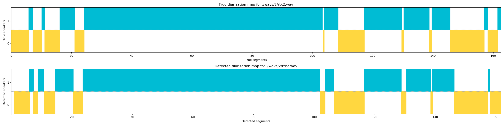
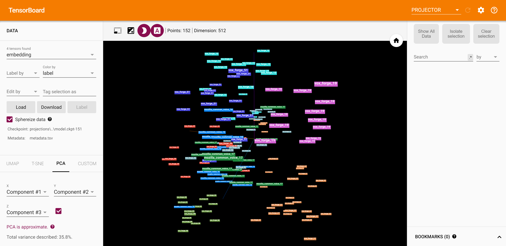

# Speaker Diarization: A System For Solving Cocktail Party Problem With Partial Speakers Identification.

Reimplementation of diarization module by Dong Lu | [Source](https://github.com/taylorlu/Speaker-Diarization)

## Overview

That module is neural speaker embedding system.
Each embedding is D-vector (512 dimensional voice feature vector generated by NN).
After feature extraction vectors it is necessary to reduce the dimension to two or three dimensions and
then cluster them by HDBSCAN.

## Example

<div align="center">
  
</div>

All segments output in console:

```
0
0:00.896 --> 0:06.160
0:07.323 --> 0:08.816
0:10.795 --> 0:14.448
0:20.501 --> 0:23.603
1:41.906 --> 1:43.648
1:46.538 --> 1:56.624
2:08.846 --> 2:10.422
2:18.452 --> 2:19.740
2:26.274 --> 2:37.370
2:38.100 --> 2:41.682

1
0:06.160 --> 0:07.323
0:08.816 --> 0:10.795
0:14.448 --> 0:20.501
0:23.603 --> 1:41.906
1:43.648 --> 1:46.538
1:56.624 --> 2:08.846
2:10.422 --> 2:18.452
2:19.740 --> 2:26.274
2:37.370 --> 2:38.100
```

And `DER` (Diarization Error Rate) in this case is `8.811%`.

## Features

D-vectors + UMAP/t-SNE + HDBSCAN + KNN
 - UIS-RNN replaced on HDBSCAN clustering
 - Partial speaker identification from voices pull
 - Second plot for true segments map
 - DER output
 - TensorBoard embeddings visualization

## Usage

#### Diarization module
 
 - Run in console `git clone https://github.com/RoyalStorm/speaker-diarization.git`
 - In `diarization.py` change path to your `*.wav` file
 - (Optional) Create `true.txt` file with true segments and put it with your audio
 
 #### TensorBoard
 <div align="center">
   
 </div>

## License

[Apache](LICENSE)