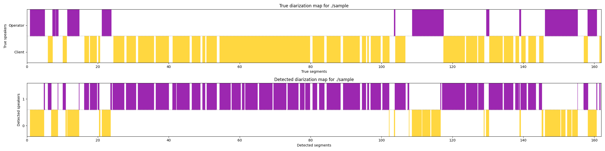
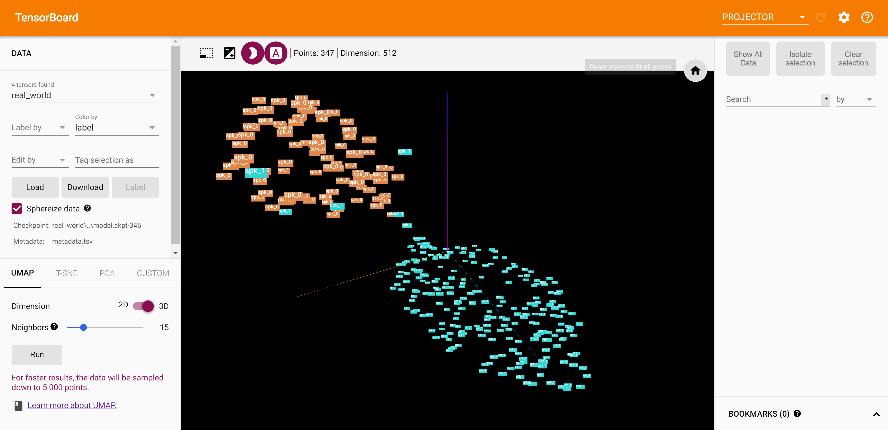

# Speaker Diarization: A System For Solving Cocktail Party Problem With Partial Speakers Identification.

Reimplementation of diarization module by Dong Lu | [Source](https://github.com/taylorlu/Speaker-Diarization)

## Overview

That module based on neural speaker embedding system. Each embedding is `D-vector` (512 dimensional voice feature vector
generated by NN). After feature extraction vectors it is necessary to reduce the dimension to two or three dimensions
and cluster them by `HDBSCAN`.

## Example

<div align="center">
  
</div>

All segments will be saved in `ref.txt` file in folder with audio (by default, it's `./sample`):

```
0
0:00.896 --> 0:06.16
0:07.323 --> 0:08.816
0:10.795 --> 0:14.448
0:20.501 --> 0:23.603
1:41.906 --> 1:43.648
1:46.538 --> 1:56.624
2:09.755 --> 2:10.422
2:18.452 --> 2:19.74
2:26.274 --> 2:37.370
2:38.100 --> 2:41.682

1
0:06.16 --> 0:07.323
0:08.816 --> 0:10.795
0:14.448 --> 0:20.501
0:23.603 --> 1:41.906
1:43.648 --> 1:46.538
1:56.624 --> 2:09.755
2:10.422 --> 2:18.452
2:19.74 --> 2:26.274
2:37.370 --> 2:38.100

0.08366
```

And `DER` (Diarization Error Rate) in this case is `8.366%`.

## Features

D-vectors + UMAP/t-SNE + HDBSCAN
 - UIS-RNN replaced on HDBSCAN clustering
 - Second plot for true segments map
 - VAD
 - DER output
 - TensorBoard embeddings visualization

## Usage

#### Diarization module
 
```python
from embedding import cluster_utils, model, consts, new_utils, toolkits
from visualization.viewer import PlotDiar

# Step 1. We may initialize GPU device, but it optional.
toolkits.initialize_GPU(consts.nn_params.gpu)

# Step 2. First of all, we need to create model and load weights.
model = model.vggvox_resnet2d_icassp(input_dim=consts.nn_params.input_dim,
                                     num_class=consts.nn_params.num_classes,
                                     mode=consts.nn_params.mode,
                                     params=consts.nn_params)
model.load_weights(consts.nn_params.weights, by_name=True)

# Step 3. Now we need to apply slide window to selected audio.
specs, intervals = new_utils.slide_window(audio_folder=consts.audio_dir,
                                          embedding_per_second=consts.slide_window_params.embedding_per_second,
                                          overlap_rate=consts.slide_window_params.overlap_rate)

# Step 4. Generate embeddings from slices audio.
embeddings = new_utils.generate_embeddings(model, specs)

# Step 5. It step optionally, but I highly recommend reduce embeddings dimension to 2 or 3.
embeddings = cluster_utils.umap_transform(embeddings)

# Step 6. Cluster all embeddings. Labels may contains noise (label will be "-1"), it should be remove from list.
predicted_labels = cluster_utils.cluster_by_hdbscan(embeddings)

# Step 7. We can visualize generated embeddings with predicted labels.
# new_utils.visualize(embeddings, predicted_label)

# Step 8. Read real segments from file.
ground_truth_map = new_utils.reference(consts.audio_dir)

# Step 9. Get result segments.
result_map = new_utils.result_map(intervals, predicted_labels)

# Step 10. Get DER (diarization error rate).
der = new_utils.der(ground_truth_map, result_map)

# Step 11. And now we can show both plots (ground truth and result).
plot = PlotDiar(true_map=ground_truth_map, map=result_map, wav=consts.audio_dir, gui=True, size=(24, 6))
plot.draw_true_map()
plot.draw_map()
plot.show()

# Step 12. Save timestamps, der, plot and report about it.
new_utils.save_and_report(plot=plot,
                          result_map=result_map,
                          dim_reduce_params=consts.umap_params,
                          cluster_params=consts.hdbscan_params,
                          der=der)
```
 
#### TensorBoard

For TensorBoard embeddings visualization run `visualize()` function in `diarization.py` script. 
 
<div align="center">
  
</div>

## License

[Apache-2.0](LICENSE)